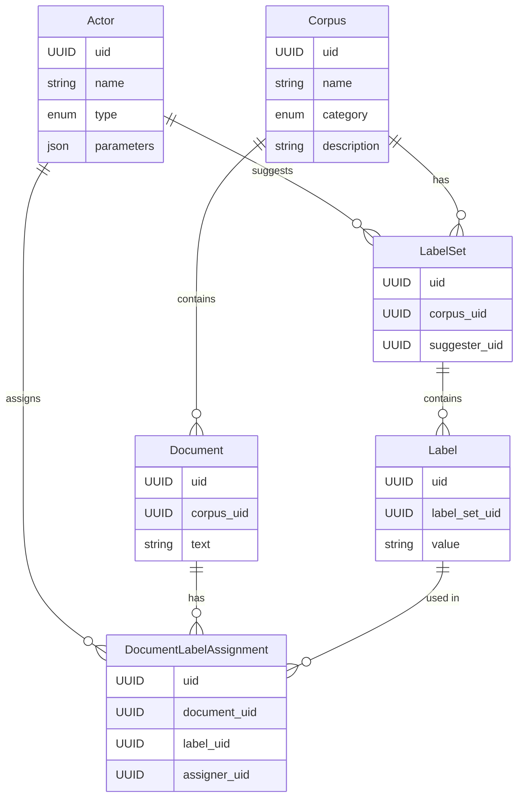

# Master's Thesis DB

## Описание

Этот проект предназначен для работы с базой данных, связанной с моей магистерской диссертацией. В данном руководстве описаны шаги по установке зависимостей с помощью [uv](https://github.com/astral-sh/uv), инициализации базы данных и выполнению примерного запроса.

База данных будет хранить информацию о текстовых комментариях, которые я собираюсь использовать в своей работе.

Каждый текстовый комментарий привязан к корпусу, корпуса целостно используются для обучения и проверки моделей.

Для корпуса существует набор лейблов (тем), которые привязаны к комментариям. При этом наборов может быть несколько (ground truth от человека и варианты от моделей) и темы могут быть назначены комментариям вручную человеком или автоматически с помощью модели.

## Модели данных

База данных содержит следующие основные модели:

- **Actor**: Человек или модель (LLM, NLI), которые предлагают или назначают лейблы.
- **Corpus**: Коллекция документов, предназначенная для обучения, валидации или других целей.
- **Document**: Текстовый комментарий, принадлежащий определенному корпусу.
- **LabelSet**: Набор лейблов (тем), предложенных для документов в определенном корпусе определенным актором.
- **Label**: Конкретный лейбл (тема), принадлежащий к определенному набору лейблов.
- **DocumentLabelAssignment**: Связь между документом и лейблом, установленная определенным актором.

### Диаграмма базы данных



## Установка зависимостей

1. Установите [uv](https://docs.astral.sh/uv/getting-started/installation/):

2. Установите зависимости проекта:

   ```bash
   uv sync
   ```

## Инициализация базы данных

1. Проверьте настройки подключения к базе данных в файле конфигурации (например, `.env`). Поддерживаются PostgreSQL и SQLite.
     - PostgreSQL:

       ```env
       MSCTHESIS_DB_URI=postgresql://localhost:5432/mscthesis
       ```
     - SQLite:
     
       ```env
       MSCTHESIS_DB_URI=sqlite:///mscthesis.db
       ```
2. Используйте скрипт инициализации с dummy данными:

   ```bash
   uv run python -m scripts.bootstrap_db
   ```

## Пример запроса

Пример запроса расположен в файле `notebooks/example_query.ipynb`
